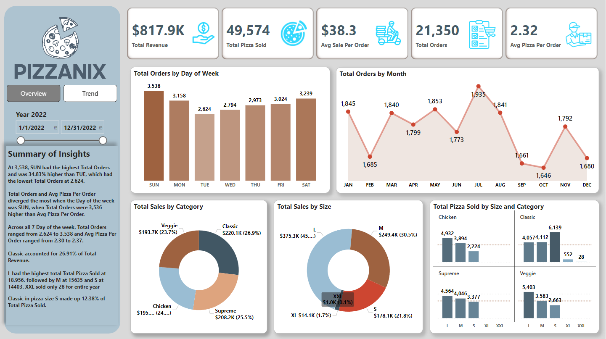
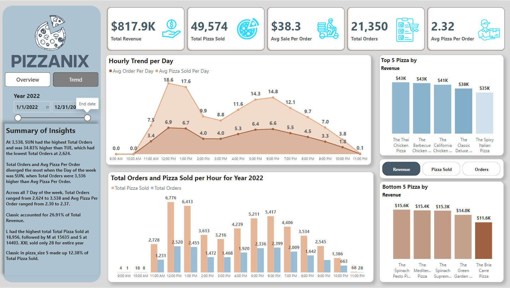

# Pizzanix Sales Analysis
Pizzanix showcase a very diverse menu, featuring a wide range of options to cater to different tastes and preferences. From Classic flavors to unique creations like BBQ Chicken, Veggies and Supreme. Additionally, it offers various sizes to accommodate individual appetites or group gatherings from the smallest, S to the largest, XXL.

## Problem Statement

- Provide and analyze list of Key performance indicator (KPI) using specific metrics to evaluate the business performance for the past 12 months
  - Total Sales, pizza sold and orders
  - Average value and pizza sold per order
- Total Orders weekly (day of week) and monthly for the stock inventory
- Daily and Monthly Pizza Sold and Orders Trend
- Percentage sales of pizza by size and flavor category
- Hourly Order trend for worker's time and workload management
- List of top 5 and bottom 5 selling pizzas by total sales, quantity and orders

Data insights will be used for the next strategic planning of the business

## Metrics
- Total Revenue - sum of price of pizza orders
  
- Total Pizza Sold - sum of the quantities of pizzas sold 
  
- Total Orders - total number of order placed
  
- Avg Order per value - average price amount spent per order

- Avg Pizzas per order - average number of pizza sold per order

## Data Visualization
For full page link of the Power BI Dashboard click this link - [App Power BI link](https://app.powerbi.com/reportEmbed?reportId=bff43e67-df8a-45ab-b829-2daf0a4da340&autoAuth=true&ctid=a4e78b81-874a-4832-88f0-12bd163108f4)

## Summary of Insights

  - Pizza sells the most during weekdays (Sunday and Saturday)
    
  - July had the highest number of orders followed by January, March, May and August
    
  - Each pizza category sells almost evenly - Classic (27%), Supreme (25%), Chicken (24%), Veggie (24%)
    
  - Large(46%) pizza sells the most followed by Medium(30.5%) and Small(21.8%).
  
  - XL(1.7%) and XXL(0.1%) doesn't sell much with total of 552 pizza sold for XL and only 28 for XXL for the past 12 months
  
  - Peak hour of selling pizza is around 12PM. Low orders between 9AM-11AM and 10PM-12AM

  - Top selling pizzas are Thai Chicken, BBQ Chicken, California Chicken, Classic Deluxe and Spicy Italian

  - Bottom seeling pizzas are Brie Carre, Green Garden, Spinach Supreme, Mediterranean and Spinach Pesto

## Recommendations
<b>To convert Casual riders or gradually convince them to upgrade to Membership, below are the recommendations:</b>

  - Start with creating promos in riding a bike during weekdays and then add new option to current Single ride and Full day pass – Whole week pass with an option of upgrade to 6 months or whole year pass (Membership) with discount.
  
  - Create a simple report tool that can check casual riders with multiple consecutive purchase of Single ride, Full day or Whole week passes. And give them an option to Upgrade to Membership with good discount.
  
  - Create a promo to Casual riders that if they reached a certain Miles/Length of ride, number of rides, duration of ride, etc.,  they can receive rewards or special discount to upgrade.

## Data Analysis Presentation
